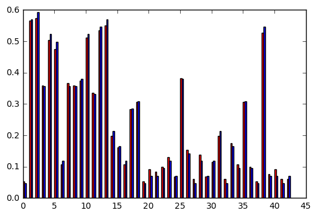
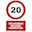
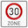
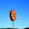

# Traffic Sign Recognition
---

**Build a Traffic Sign Recognition Project**

The goals / steps of this project are the following:
* Load the data set (see below for links to the project data set)
* Explore, summarize and visualize the data set
* Design, train and test a model architecture
* Use the model to make predictions on new images
* Analyze the softmax probabilities of the new images
* Summarize the results with a written report

## Rubric Points
Here I will consider the [rubric points](https://review.udacity.com/#!/rubrics/481/view) individually and describe how I addressed each point in my implementation.  

---
### Writeup / README

#### 1. Provide a Writeup / README that includes all the rubric points and how you addressed each one. You can submit your writeup as markdown or pdf. You can use this template as a guide for writing the report. The submission includes the project code.

The submission includes the following materials: 
- [x] A runnable iPython notebook contains details of my implementation, simply referenced as notebook in below;
- [x] A report, the "Traffic Sign Recognition.md";
- [x] A HTML file which records the notebook result. 
- [x] A folder named "img4report" containing the images needed by the report;
- [x] A folder named "test-images" containing the images collected from the web;
 

### Data Set Summary & Exploration

#### 1. Provide a basic summary of the data set and identify where in your code the summary was done. In the code, the analysis should be done using python, numpy and/or pandas methods rather than hardcoding results manually.

The code and summary is given in the notebook section "Rubric 2.1: Dataset Summary & Exploration". 

Here I performed the dataset sanity check, mapped the images to their names, did statistics on sample number and their distribution per category. 

#### 2. Include an exploratory visualization of the dataset and identify where the code is in your code file.

The code of doing the exploratory visualization is given in section "Rubric 2.2 Sample category distribution". Here I attached the histogram generated.

As can be seen in above graph that:
1. the number of samples contained in each class varies dramatically;
1. the number of each class follows nearly the same pattern in both training and testing classes;

A warning message of this dataset is that the unbalanced data distribution would lead to the trained model inclined to the category with more samples.

### Design and Test a Model Architecture

#### 1. Describe how, and identify where in your code, you preprocessed the image data. What techniques were chosen and why did you choose these techniques? Consider including images showing the output of each preprocessing technique. Pre-processing refers to techniques such as converting to grayscale, normalization, etc.

I defined a simple LeNet-5 architecture and applied it to traffic data set, and got a validation accuracy of 0.941 and the test accuracy of 0.855, while with MNIST dataset the validation accuracy and test accuracy are 0.99 and 0.989 respectively, seems there were a big gap. My first thought was to gray-scale the traffic sign images and apply the network to it. 

With the same hyper-parameters (learning rate, epochs, batch-size etc), after the preprocessing, the validation accuracy increased from 0.941 to 0.956; the test accuracy increased from 0.855 to 0.882; 

To further improve the performance, I increased the epochs from 10 to 50, and finally got a validation accuracy of 0.977 and test accuracy of 0.907. 

From the testing result, gray-scale did help in performance. The code for the training process is in notebook section "Rubric 3.1, data preprocessing - grayscale"

Below is a grayed example image . 

#### 2. Describe how, and identify where in your code, you set up training, validation and testing data. How much data was in each set? Explain what techniques were used to split the data into these sets. (OPTIONAL: As described in the "Stand Out Suggestions" part of the rubric, if you generated additional data for training, describe why you decided to generate additional data, how you generated the data, identify where in your code, and provide example images of the additional data)

The code for splitting the data into training and validation sets is contained in the notebook section "Rubric 3.2, data splitting".

The original 39209 training images were randomly split into two data sets, one for training and one for validation with a ratio of 0.2, which leads to a final training data size of 31367, validation size 7842, testing size 12630.

#### 3. Describe, and identify where in your code, what your final model architecture looks like including model type, layers, layer sizes, connectivity, etc.) Consider including a diagram and/or table describing the final model.

The code for my final model is located in the notebook section "Rubric 3.3, model definition"

I used the CNN model and the LeNet5 implementation. Details are given in below table:

| Layer         		|     Description	        					| 
|:---------------------:|:---------------------------------------------:| 
| Input         		| 32x32x1 Gray scale image  					| 
| Convolution 5x5     	| 1x1 stride, valid padding, outputs 28x28x6 	|
| RELU					|												|
| Max pooling	      	| 2x2 stride, valid padding, outputs 14x14x6	|
| Convolution 5x5       | 1x1 stride, valid padding, outputs 10x10x16   |
| RELU                  |                                               |
| Max pooling           | 2x2 stride, valid padding, outputs 5x5x16     |
| Fully connected		| input 400, output 120                         |
| Fully connected       | input 120, output 84                          |
| Fully connected       | input 84, output 43                           |
| matmul				| output label        							|

The model contains 64511 parameters, calculated like below:

- first conv-layer:  5x5x1x6+6 = 156
- second conv-layer: 5x5x6x16+16 = 2416
- first fully-layer: 400x120+120 = 48120
- second fully-layer: 120x84+84 = 10164
- last fully-layer:  84x43+43 = 3655

#### 4. Describe how, and identify where in your code, you trained your model. The discussion can include the type of optimizer, the batch size, number of epochs and any hyperparameters such as learning rate.

The code is given in section "Rubric 3.4 Training the model".
To train the model, I used the following hype parameters:
- batch size 128;
- epochs, 50, tried 10 and 50, and 50 was better;
- learning rate, 0.001, also tried 0.0001, but the performance was not obvious;
- optimizer, used AdamOptimizer. 

#### 5. Describe the approach taken for finding a solution. Include in the discussion the results on the training, validation and test sets and where in the code these were calculated. Your approach may have been an iterative process, in which case, outline the steps you took to get to the final solution and why you chose those steps. Perhaps your solution involved an already well known implementation or architecture. In this case, discuss why you think the architecture is suitable for the current problem.

I used trial and error process. Since the LeNet5 works pretty well on the MNIST data, my first idea was to use it directly to the traffic data set, analyzing the performance gap then took relevant steps based on the gap analysis. Then, I came up with ideas of data preprocessing (gray-scale), adjust learning rate (from 0.001 to 0.0001), adjusting the epochs (from 10 to 50), with these steps, the performance shows a sign of improving.

### Test a Model on New Images

#### 1. Choose five German traffic signs found on the web and provide them in the report. For each image, discuss what quality or qualities might be difficult to classify.

I collected 5 images from Google Image. The images collected varies in dimensions, I resized them to 32*32, they are displayed below.

As can be seen, the qualities of these images varies, for example, the first images is a "speed 20" sign, a large portion of the image is occupied by a warning message rectangle; the number two image is in good quality; the number three image is a "speed 50" sign, but once resized, it is hardly recognizable even by human eyes; the number 4 image is also a "speed 50" sign, but the sign shifted to the left bottom corner, leaving a large portion of blank background ; number 5 is a stop sign, it's relatively in good quality; So, the image resizing, noisy information and shifting of object all these could affect the prediction result; 

1. 
2. 
3. 
4. 
5. 

#### 2. Discuss the model's predictions on these new traffic signs and compare the results to predicting on the test set. Identify where in your code predictions were made. At a minimum, discuss what the predictions were, the accuracy on these new predictions, and compare the accuracy to the accuracy on the test set (OPTIONAL: Discuss the results in more detail as described in the "Stand Out Suggestions" part of the rubric).

The code for making predictions on my final model is located in notebook section "Rubric 4.2, Making predictions"

The model performs worse on my test data than the given test data set, my data set only gets 20% accuracy, which is one out of five images right, it's a very bad predictor, because it's no better than random guess. 

#### 3. Describe how certain the model is when predicting on each of the five new images by looking at the softmax probabilities for each prediction and identify where in your code softmax probabilities were outputted. Provide the top 5 softmax probabilities for each image along with the sign type of each probability. (OPTIONAL: as described in the "Stand Out Suggestions" part of the rubric, visualizations can also be provided such as bar charts)

For the first image, the model is confused the image with `Yield` sign. The top five softmax probabilities are:

| Probability  |     Prediction                              |
|:------------:|:-------------------------------------------:|
| 0.991        |Yield                                        |
| 0.009        |Speed limit (50km/h)                         |
| 0.000        |Keep right                                   |
| 0.000        |Slippery road                                |
| 0.000        |Turn left ahead                              |

The model is very good at the second image, with almost 100% confidence.

| Probability  |     Prediction                              |
|:------------:|:-------------------------------------------:|
| 1.000        |Speed limit (30km/h)                         |
| 0.000        |Stop                                         |
| 0.000        |Roundabout mandatory                         |
| 0.000        |Right-of-way at the next intersection        |
| 0.000        |Speed limit (60km/h)                         |

For the third image, the model has hesitation, but neither were correct prediction.

| Probability  |     Prediction                              |
|:------------:|:-------------------------------------------:|
| 0.825        |Right-of-way at the next intersection        |
| 0.171        |No passing for vehicles over 3.5 metric tons |
| 0.004        |Speed limit (60km/h)                         |
| 0.000        |Speed limit (100km/h)                        |
| 0.000        |Speed limit (80km/h)                         |

For the fourth image, the model is totally wrong. After resizing, the image is hardly recognizable by human eyes. 

| Probability  |     Prediction                              |
|:------------:|:-------------------------------------------:|
| 1.000        |Yield                                        |
| 0.000        |Stop                                         |
| 0.000        |Speed limit (60km/h)                         |
| 0.000        |Speed limit (120km/h)                        |
| 0.000        |Children crossing                            |

For the fifth image, the model is totally wrong. This may caused by the shifting of the main object. 

| Probability  |     Prediction                              |
|:------------:|:-------------------------------------------:|
| 1.000        |Go straight or left                          |
| 0.000        |Ahead only                                   |
| 0.000        |Dangerous curve to the left                  |
| 0.000        |Pedestrians                                  |
| 0.000        |Double curve                                 |

